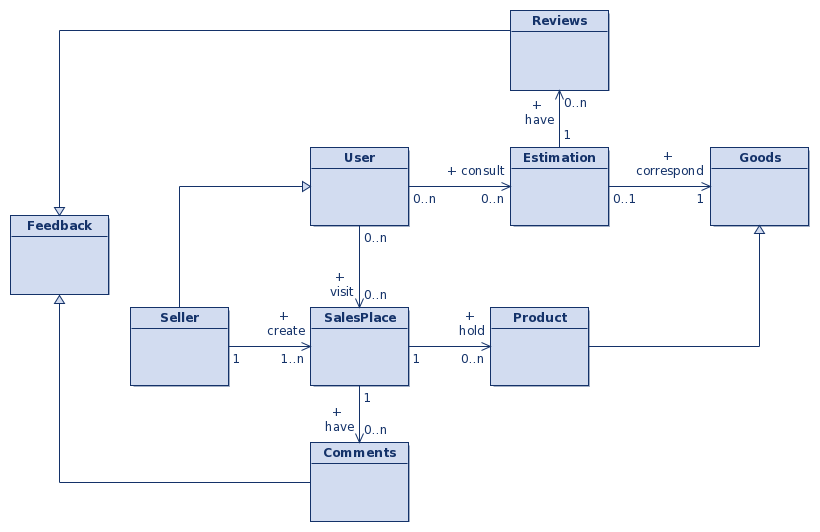

# Software Design

## Actors
In our system, we will have 3 actors:

- The user
- The seller
- The customer

### The user
Represents the main actor of the system.

### The seller
Is a potential seller looking for customers.

### The system
Represents the AI behind the application.

## Use Case Diagram

### Use Case Descriptions

#### Check Price of a Good
The user enters the name of a good and gets an estimated price. They can see more information, such as:

- Estimation by location
- Estimation by market
- How the estimation was done
- If other customers approved it

#### Browse a Market
The user opens the market page and can see registered markets by location and the market price stability level of each market. They can also see the different market sales places.

#### Send Feedback
When the user detects a wrong estimation or a fraud in the application, they can send a signal. These different signals can be:

- Feedback about a market price
- Feedback about a sales place

#### Create Sales Place
The seller enters some information about themselves and their sales place.

#### Update an Article
The seller enters some information about the article they offer.

#### Update Market Price
The AI is frequently analyzing collected data to offer better estimations.

## Activity Diagrams

### Check Market Price

### Browse a Market

### Send Feedback

### Create Sales Place

### Update Article

### Update Market Price

## Class Diagram
.