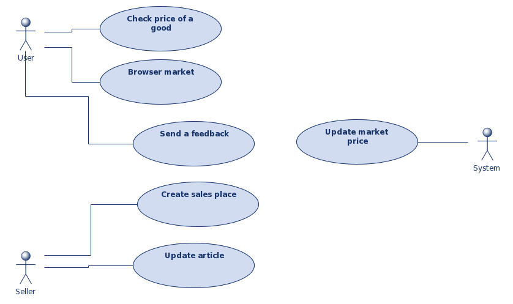
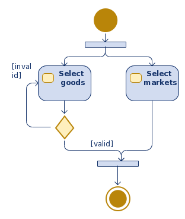
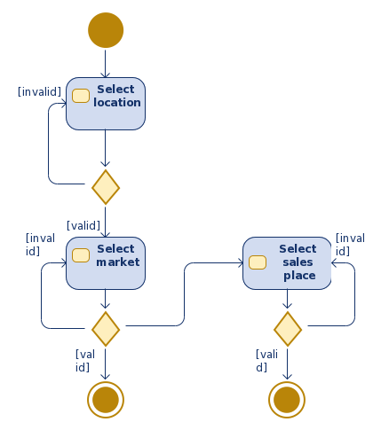
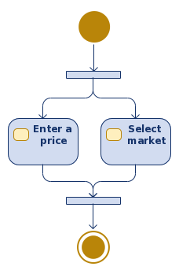
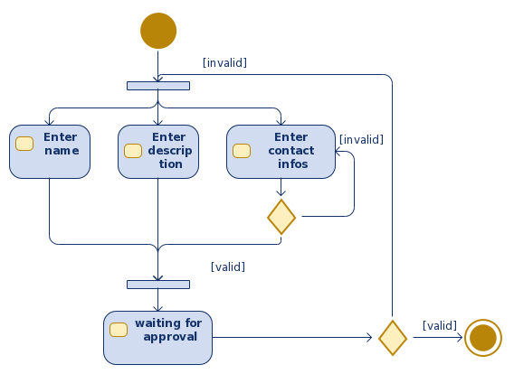
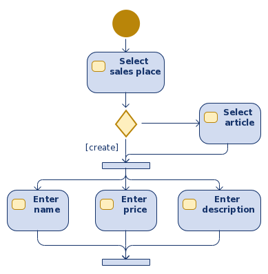
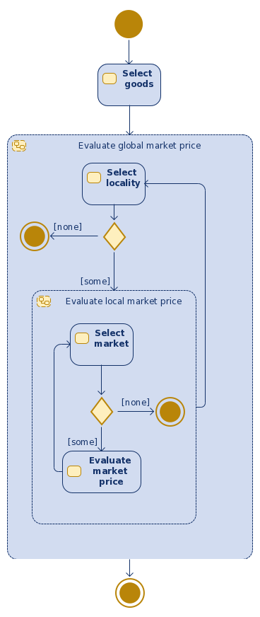

# Software Design

## Actors
In our system, we will have 3 actors.

- The user
- The seller
- The customer

### The user
Represent the main actor of the system.

### The seller
It's a potential seller looking for customer.

### The system
Represent the AI behind the application.

## Use Case Diagram

### User case description

#### Check price of a good
The user enter the name of a good and get the estimation price.
It can see more information like:

- estimation by location
- estimation by market
- how the estimation was done
- if another customers approved it

#### Browse a Market
The user open the market page and can see registered markets by location and the market price stability level of each market.
Can also see the different market sales places.

#### Send a feedback
When the user detect a wrong estimation or a fraud in the application, he can send signal it.
These different signalling can be:

- Feedback about a market price
- Feedback about a sales place

#### Create sales place
The seller enter some information about him and his sales place.

#### Update an article
The seller enter some information about the article he offer.

#### Update market price
The AI is frequently analyzing collected data to offer better estimation.

## Activity Diagram

### Check market price

### Browse a market

### Send feedback

### Create sales place

### Update article

### Update market price

## Class diagram
TODO